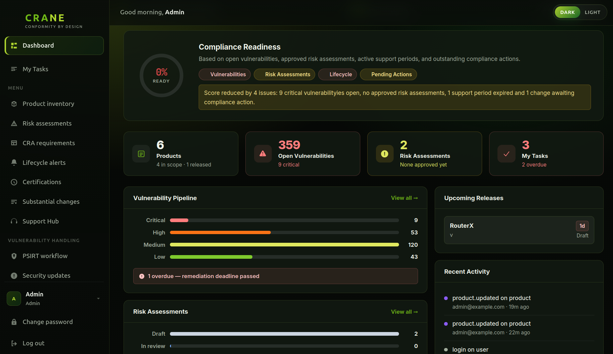
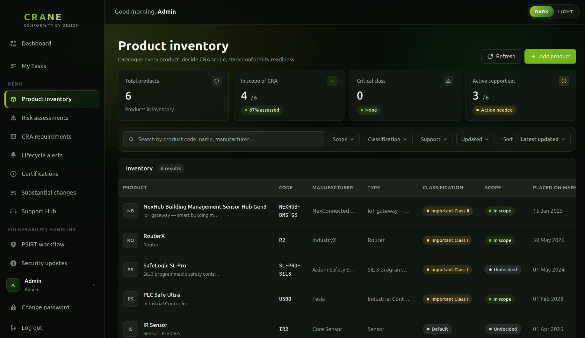

# CRANE — CRA Norm Engine


**Self-hosted compliance management for the EU Cyber Resilience Act.**

CRANE helps manufacturers of products with digital elements meet their CRA obligations — from SBOM analysis and vulnerability tracking to release gates and lifecycle notifications — in one auditable, self-hosted platform.

---

## ⚠️ Maturity & Production Readiness

CRANE is **beta software** used in real compliance engagements. Core modules (product registry, SBOM analysis, vulnerability tracking) are stable and production-ready. Some advanced features (substantial change assessment, automated integrations) are still evolving.

**Before deploying to production:**
- Review the [Installation & Deployment Guide](docs/installation.html) thoroughly
- Use [`docker-compose.prod.yml`](docker-compose.prod.yml) — **never use `docker-compose.yml` in production**
- Set strong database and secret key values (see [.env.example](.env.example))
- Run behind a reverse proxy with TLS (nginx, Caddy, etc.)
- Regularly apply security updates to OS and dependencies
- Have a backup and recovery procedure in place

**Not recommended for:** Fully unattended production use without a designated operator. Plan for at least one person to monitor logs and handle database migrations during upgrades.

---

Control CRA compliance via an up-to-date dashboard with the most important information.



---

Comprehensive overview of products with required CRA properties and justifications.



---

## Who is this for?

| Audience | How CRANE helps |
|---|---|
| **Small & medium manufacturers** | Affordable alternative to expensive GRC platforms — self-host with Docker in minutes |
| **Software manufacturers** | Track products, releases, SBOMs, and vulnerabilities in one place from day one of CRA |
| **Consultants** | Deploy a dedicated instance per client engagement; portable data export at project close |
| **Education & research** | Free, open source, fully documented — ideal for CRA training and academic research |
| **Critical infrastructure operators** | Self-hosted with no external data sharing; LDAP/AD integration for enterprise environments |

---

## Real-world scenarios

### 🏭 Industrial IoT Manufacturer

A manufacturer of connected sensors deployed in factories across the EU needs to demonstrate CRA compliance before placing products on the market.

**With CRANE:**
- Registers each sensor model as a product with hardware and firmware versions
- Uploads CycloneDX SBOMs per firmware release — CRANE scores quality and validates CRA requirements
- Runs vulnerability scans via Trivy and OSV; EPSS scores prioritise which CVEs to fix first
- Configures a release gate requiring a passed risk assessment, pentest report, and SBOM before any firmware ships
- Defines a support period per product line with automated end-of-support alerts to customers
- Exports a complete audit package when the Notified Body requests evidence

---

### 💡 Small IoT Startup

A 10-person startup ships a smart energy monitor for residential use. They have no dedicated compliance team and CRA is their first regulatory challenge.

**With CRANE:**
- Sets up the product registry in under an hour using Docker Compose — no infrastructure expertise needed
- Uploads their first SBOM and immediately sees which open source components carry known CVEs
- Uses the CRA Annex I matrix to understand which obligations apply and track progress against each one
- Classifies their cloud backend using the Article 3(2) wizard — determines it is in scope and documents the rationale
- Publishes a CVD policy so security researchers know how to report vulnerabilities responsibly
- When a critical CVE hits a dependency, the team logs the vulnerability report, patches it, issues a security update, and has a full audit trail — all in one place
- Downloads technical documentation needed for internal conformity assessment and CE marking

---

### 🧑‍💼 CRA Compliance Consultant

A consultant runs CRA programmes for five SME clients simultaneously. Each client needs their own compliant product registry and evidence trail.

**With CRANE:**
- Deploys one self-hosted CRANE instance per client — fully isolated data, no cross-contamination
- Uses role-based access control to give each client's team read access while retaining admin control
- Assesses remote processing elements (cloud backends, update servers) against CRA Article 3(2) using the built-in DIGITALEUROPE I1/I3/I5/I6 classification wizard
- Exports the complete dataset at project close — client takes ownership with no vendor lock-in
- Uses test-data fixtures to demonstrate the tool during CRA awareness workshops
- All instances are AGPL-licensed — no per-seat or per-client licensing costs

---

### 🎓 Training & Research

A training provider running a cybersecurity engineering course uses CRANE to teach students how CRA compliance works in practice — not just in theory.

**With CRANE:**
- Spins up a shared instance for the class in minutes — students get individual accounts with scoped roles
- Each student team registers a fictional product and works through the full compliance lifecycle: SBOM, risk assessment, vulnerability handling, release gate
- Instructors use the audit log to review every action taken by each team — traceable, timestamped, tamper-evident
- Researchers studying EU product regulation use CRANE as a live reference implementation of CRA Article 3, Annex I, and Annex II obligations
- Fully open source and free — no licensing barriers for training use

---

## Features

| Area | What it does |
|---|---|
| **Product registry** | Track products, versions, releases, and support periods |
| **Release gates** | Structured readiness checklist with evidence before every release |
| **SBOM analysis** | Quality scoring, CRA validation, NTIA compliance, diff view |
| **Vulnerability management** | PSIRT workflow, CVE tracking, EPSS scoring, VEX assessments |
| **Security operations** | Advisories, CVD policies, update history, incoming report triage |
| **Risk assessments** | STRIDE / TARA / custom methodology, approval workflow |
| **CRA Annex I matrix** | Requirement coverage map per product with evidence links |
| **Substantial changes** | Change assessment and re-conformity tracking |
| **Lifecycle alerts** | End-of-support monitoring with configurable thresholds |
| **Audit trail** | Immutable, timestamped log of every action |
| **Technical documentation** | One-click export ready for conformity assessment |
| **Team collaboration** | Multi-user platform, task assignment, commenting |
| **RBAC + LDAP** | Role-based access control, Active Directory / OpenLDAP integration |

---

## Installation

### Prerequisites

- [Docker Desktop](https://docs.docker.com/get-docker/) or Docker Engine + Docker Compose
  - **Windows:** Docker set to **Linux containers** (right-click Docker tray icon to switch)
- **Git** (optional, for development)

### Quick Start (Recommended)

Clone the repository and configure:

```bash
git clone https://github.com/cra-norm-engine/crane.git
cd crane

# Copy the environment template
cp .env.example .env

# Edit .env and set these required values:
# - POSTGRES_PASSWORD (min 32 random characters)
# - BACKEND_SECRET_KEY (min 32 random characters)
# Generate strong values: openssl rand -hex 32
nano .env

# Start all services
docker compose up -d
```

The first run takes 3–5 minutes while Docker builds the backend image and downloads the vulnerability database.

**For comprehensive installation guidance** (system requirements, pre-flight checks, troubleshooting, upgrades, air-gapped deployment, reverse proxy setup), see the [Installation & Deployment Guide](docs/installation.html).

### Automated Installation (Optional)

For convenience, we provide shell scripts that automate the clone-and-configure steps:

<details>
<summary>Linux / macOS</summary>

```bash
cd ~/Desktop
curl -fsSL https://raw.githubusercontent.com/cra-norm-engine/crane/main/install.sh | bash
```

**Note:** Always review shell scripts before piping to bash. You can download and inspect the script first:

```bash
curl -fsSL https://raw.githubusercontent.com/cra-norm-engine/crane/main/install.sh -o install.sh
cat install.sh  # Review the script
bash install.sh
```

</details>

<details>
<summary>Windows (PowerShell)</summary>

```powershell
cd $HOME\Desktop
irm https://raw.githubusercontent.com/cra-norm-engine/crane/main/install.ps1 | iex
```

Or download and review first:

```powershell
irm https://raw.githubusercontent.com/cra-norm-engine/crane/main/install.ps1 -OutFile install.ps1
Get-Content install.ps1  # Review the script
.\install.ps1
```

</details>

### Production Deployment

For production environments, use the production compose configuration with strict security settings:

```bash
docker compose -f docker-compose.prod.yml up -d
```

**Required before production:**

1. Edit `.env` and set strong, random values for `POSTGRES_PASSWORD` and `BACKEND_SECRET_KEY`
2. Update `BACKEND_CORS_ORIGINS` to your domain (e.g., `https://compliance.example.com`)
3. Run behind a reverse proxy with TLS ([nginx](https://nginx.org/), [Caddy](https://caddyserver.com/), etc.)
4. Restrict database port to localhost-only (already done in `docker-compose.prod.yml`)
5. See the [Installation & Deployment Guide](docs/installation.html) for system requirements, pre-flight checks, and TLS setup examples

**Key differences from development:**

- No source code volume mounts
- Pre-built Docker images from GitHub Container Registry
- Resource limits enforced
- Database port only accessible from localhost
- Debug mode disabled
- Structured logging

### Access the app

| Service | URL |
|---|---|
| App | http://localhost:5173 |
| API | http://localhost:8000/api/v1 |
| API docs | http://localhost:8000/docs |

### Default login

| Field | Value |
|---|---|
| Email | `admin@example.com` |
| Password | `admin1234` |

You will be prompted to set a new password on first login.

---

## Stack

**Backend:** FastAPI · SQLAlchemy 2 · PostgreSQL 16 · Alembic · Pydantic v2  
**Frontend:** Vue 3 · TypeScript · Pinia · Vite  
**Scanning:** Trivy (optional) · OSV · NVD · EPSS by FIRST.org

---

## Roadmap

<table>
<tr>
<td width="33%" valign="top">

### 🚀 Near Term
&nbsp;
- [ ] Full compliance with CRA reporting obligations before 11 September 2026
- [ ] Email notifications (EOS alerts, gate approvals)
- [ ] GitHub / GitLab integration

</td>
<td width="33%" valign="top">

### 📈 Medium Term
&nbsp;
- [ ] Integration of CENELEC vertical and horizontal standards
- [ ] Jira / GitHub Issues integration
- [ ] Multi-tenant support

</td>
<td width="33%" valign="top">

### 🎯 Long Term
&nbsp;
- [ ] Formalised conformity reasoning
- [ ] AI integration
- [ ] Optimisation and performance

</td>
</tr>
</table>

---

## Self-hosted by design

- All data stays in your own PostgreSQL instance
- No telemetry, no callbacks, no external dependencies at runtime
- Full data export at any time
- AGPL-3.0 — audit the code, fork it, extend it

---

## Contact

- **Issues & feature requests:** [GitHub Issues](https://github.com/cra-norm-engine/crane/issues)
- **Security vulnerabilities:** See [SECURITY.md](SECURITY.md)
- **General enquiries:** cra.norm.engine@gmail.com

---

## Contributing

See [CONTRIBUTING.md](CONTRIBUTING.md). Please open an issue before submitting a PR for significant changes.

## License

[GNU Affero General Public License v3.0](LICENSE)
